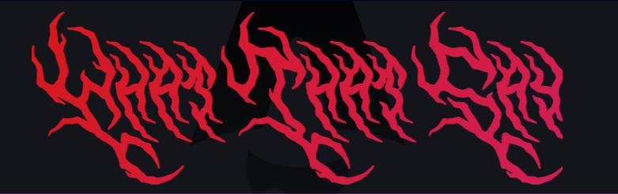
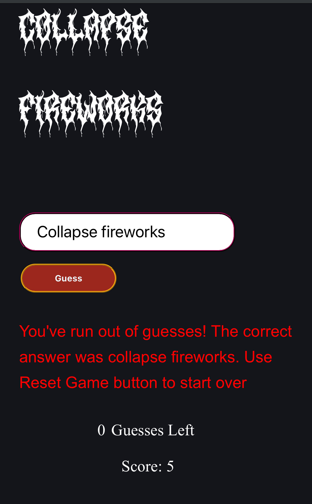
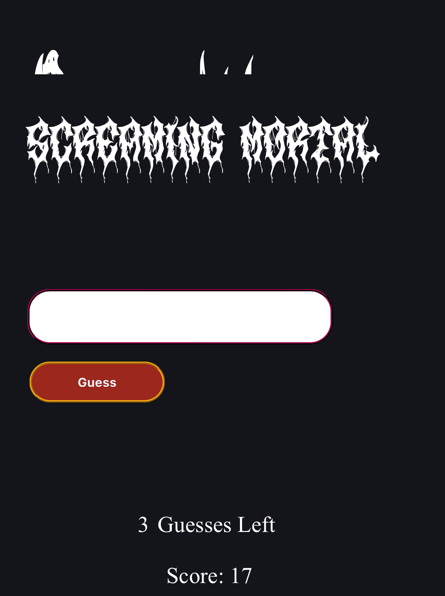

# What That Say!

### A game where you have to guess what the words are in a "Death Metal Band" type of Font.

:metal: :metal: :metal:

--Still a work in progress. Things that need to be completed:

- [x] Update README
- [x] Get Functionality working ie: score count and guess count.
- [ ] Hide the words to guess as they show in the inspector
- [x] Deploy Site
- [x] test on multiple devices
- [x] Mobile Responsive. Check site on phone as it differs from the view the console inspector gives
- [x] Write Function to get Enter key to act like user pressed guess button
- [ ] Get Score to display properly on refresh and load
- [x] Add more and more word choices so that the combos are endless!!!!
- [ ] Fix issue where some of the fonts "CronicleDemo" will overlap into the guess box area. Need to only get that one font smaller without it affecting the other fonts.
- [ ] Get the correct letter message to display better and not give away answer when user's guess is like one letter off.
- [ ] Find more Fonts to use.

## Issues

- Sometimes it says the answer is wrong, even though it should be a correct guess. See screenshot below:

- Issue only seems to happen on mobile but sometimes the font cuts off and another random font shows behind it. Doesn't affect the word combo but looks odd. Example screenshot from mobile below:

