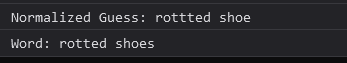
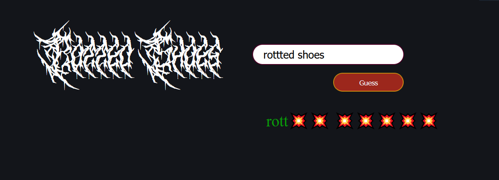

# What That Say!

### A game where you have to guess what the words are in a "Death Metal Band" type of Font.

:metal: :metal: :metal:

-- Things that need to be completed:

- [ ] Write function to make sure words don't repeat too often.
- [ ] Check bug where player guesses again and previously solved word shows as not correct. (Might be solved, as I haven't been able to recreate this scenario.)
- [ ] Add more words to the game.
- [ ] Remove test comments and console logs once testing is done.

## Issues

- [ ] Fix issue where the the Dynamically updated CSS variables for the font family and size only affect new generated words, and if CronicleDemo font loads as first word of game it's at 4rem insted of 2.5rem
- [x] Fix issue where some of the fonts "CronicleDemo" will overlap into the guess box area. Need to only get that one font smaller without it affecting the other fonts.

- [ ] Fix strange issue where user guess has extra letter in word or at end and it doesn't display the correct letters properly. Image below:
      
      

## Fixed but still Testing:

- Sometimes it says the answer is wrong, even though it should be a correct guess. See screenshot below:

- Issue only seems to happen on mobile but sometimes the font cuts off and another random font shows behind it. Doesn't affect the word combo but looks odd. Example screenshot from mobile below:

